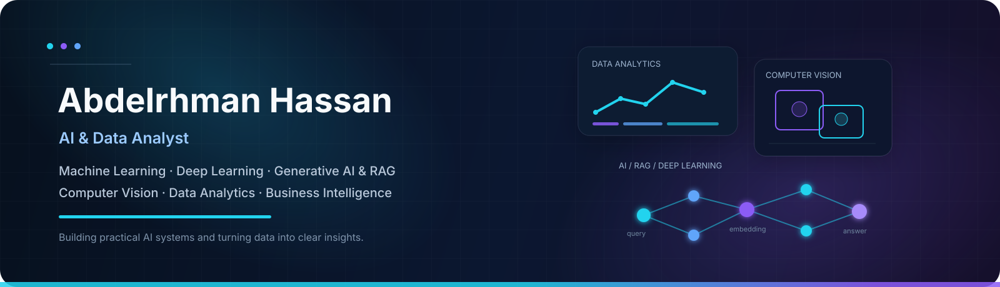

  

 

# Hi, I'm Abdelrhman Hassan 👋

### AI & Data Analyst

**Machine Learning · Deep Learning · Generative AI & RAG · Computer Vision · Data Analytics**

Turning data into clear insights and building practical AI solutions across **ML, Deep Learning, Generative AI, and Business Intelligence**.

 

---

## About Me

I'm a Computer Science graduate focused on **Artificial Intelligence, Machine Learning, Deep Learning, and Data Analytics**.

I build practical projects across **Computer Vision, RAG, predictive modeling, and Business Intelligence**, combining AI engineering with data-driven problem solving.

My work spans both traditional Machine Learning and Deep Learning, from analytical prediction models to CNN–LSTM video intelligence systems.

---

## Core Tech Stack

### 📊 Data & Analytics

### 🤖 Machine Learning

`Regression` `Classification` `Feature Engineering` `Model Evaluation` `Predictive Modeling`

### 🧠 Deep Learning & Computer Vision

`Neural Networks` `CNN` `RNN` `LSTM` `ResNet` `Transfer Learning` `Video Classification`

### ✨ Generative AI & NLP

`RAG` `Embeddings` `BM25` `TF-IDF` `Cosine Similarity` `Arabic NLP` `AraBERT` `Whisper`

### 🛠️ Tools & Platforms

`SQL Server` `PostgreSQL` `Docker` `Git` `Jupyter` `Google Colab` `Kaggle` `n8n`

---

# 🚀 Featured Projects

<table>
<tr>
<td width="50%" valign="top">

### 🎥 SCVD — Violence Intelligence Dashboard

**Deep Learning + Computer Vision**

Explainable CCTV video-analysis system that classifies temporal video segments as **Normal, Violence, or Weaponized Violence**.

The model combines **ResNet18 for spatial feature extraction** with **LSTM for temporal sequence modeling**.

Also includes an incident timeline, probability analysis, person detection in alert scenes, annotated video, and downloadable reports.

**Architecture**

`Video → Frames → ResNet18 → Features → LSTM → Classification`

**Tech**

`PyTorch` `CNN` `ResNet18` `LSTM` `OpenCV` `Streamlit`

[**View Repository →**](https://github.com/abdelrhmanmouse/SCVD-Violence-Detection)

[**Live Demo →**](https://scvd-violence-detection-m9rb8lphpu2lpth3p97xqr.streamlit.app/)

</td>

<td width="50%" valign="top">

### 🤖 HikAssist — Arabic RAG Assistant

**Generative AI + NLP + Information Retrieval**

Arabic and Egyptian-Arabic technical-support assistant combining **BM25 keyword retrieval with multilingual semantic search**.

The system retrieves relevant knowledge chunks and provides them as grounded context for LLM-generated answers.

**Pipeline**

`Query → Retrieval → BM25 + Embeddings → Context → LLM → Answer`

**Tech**

`Python` `RAG` `BM25` `Embeddings` `NLP` `Streamlit`

[**View Repository →**](https://github.com/abdelrhmanmouse/simple-rag-lab)

[**Live Demo →**](https://simple-rag-lab-ojndyxhf7bgrvhmuuw3huu.streamlit.app/)

</td>
</tr>

<tr>
<td width="50%" valign="top">

### 📊 E-Commerce Data Analysis

**Data Analytics + Business Intelligence**

Power BI analytics project transforming cleaned transaction data into a **three-page interactive business report**.

The dashboard analyzes revenue, products, customers, purchasing patterns, geographic performance, and returns.

**Tech**

`Power BI` `Data Cleaning` `EDA` `Data Visualization` `Business Intelligence`

[**View Repository →**](https://github.com/abdelrhmanmouse/ecommerce-data-analysis)

</td>

<td width="50%" valign="top">

### 📈 Body Performance Prediction

**Machine Learning + Predictive Modeling**

Machine Learning classification workflow for analyzing physical-fitness measurements and predicting body-performance classes.

The workflow covers **EDA, preprocessing, feature analysis, model training, and evaluation**.

**Tech**

`Python` `Pandas` `Scikit-learn` `Matplotlib`

[**View Repository →**](https://github.com/abdelrhmanmouse/body-performance-prediction)

</td>
</tr>
</table>

### More Projects

* 📈 [**Excel Sales Performance Dashboard**](https://github.com/abdelrhmanmouse/Excel-Sales-Performance-Dashboard) — Interactive Excel dashboard using PivotTables, PivotCharts, KPI cards, slicers, and connected navigation.

* 🗄️ [**E-Commerce SQL Database**](https://github.com/abdelrhmanmouse/ecommerce-sql-database) — Microsoft SQL Server relational database covering core e-commerce workflows and analytical queries.

---

# What I Work With

<table>
<tr>

<td width="50%" valign="top">

### 🤖 Machine Learning

* Regression
* Classification
* Feature Engineering
* Predictive Modeling
* Model Evaluation
* Regularization
* Scikit-learn

</td>

<td width="50%" valign="top">

### 🧠 Deep Learning

* Neural Networks
* CNN
* RNN
* LSTM
* ResNet
* Transfer Learning
* Video Classification
* GAN concepts

</td>

</tr>

<tr>

<td width="50%" valign="top">

### ✨ Generative AI & NLP

* Retrieval-Augmented Generation
* Embeddings
* BM25
* TF-IDF
* Natural Language Processing
* Arabic NLP
* AraBERT
* Whisper

</td>

<td width="50%" valign="top">

### 📊 Data Analytics & BI

* Data Cleaning & EDA
* Statistical Analysis
* SQL Analysis
* Power BI & Excel
* Dashboard Development
* Data Visualization
* Business Insights

</td>

</tr>
</table>

---

## 💼 Experience

### Applied AI & Data Analytics Trainee

**DigiLians**

`Artificial Intelligence` `Machine Learning` `Deep Learning` `Data Analysis` `NLP` `Computer Vision`

### Quality Engineer

**United International Company for Packing Vegetables and Fruits**

May 2023 – October 2023

### Safety & Occupational Health Specialist

Experience in workplace safety, occupational health, risk awareness, and operational procedures.

---

## 🎓 Education

### AI & Data Analysis Diploma

**DigiLians — Egyptian Military Academy / Military Technical Education**

`December 2025 – Present`
9-Month Diploma · **Grade: Very Good**

### Bachelor of Computer Science

**El Obour Higher Institute for Management and Computers — Elsharqaya**

`2019 – 2026` · **Grade: Very Good**

---

## 🏅 Certifications & Professional Learning

[**Microsoft Certified: Power BI Data Analyst Associate**](https://learn.microsoft.com/api/credentials/share/en-us/Mouseabdelrhman91303414-2513/C379CF48AA33E738?sharingId=6FA75A715766B66)
Microsoft

[**IBM AI Engineering**](https://coursera.org/share/31704841819d6c602f75f87bddf6f29d)
IBM / Coursera

[**Artificial Intelligence Engineer 2**](https://coursera.org/share/4d38c8a661ffbc62ff3c0a668f1eed87)
Coursera

[**Google Data Analytics**](https://coursera.org/share/9e854f83607e85e730e06f6164295f5f)
Google / Coursera

[**Data Analyst L1**](https://coursera.org/share/a89cc227a939d1d7688993e1eb69b555)
Coursera

---

## Let's Connect

I'm interested in opportunities across **AI, Data Analytics, Machine Learning, Deep Learning, Generative AI, and Computer Vision**.

 

